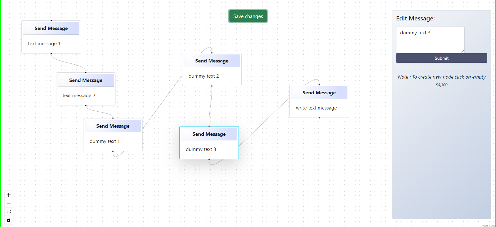

# Chatbot Flow Builder

This is a simple Chatbot Flow Builder using React and React Flow. The flow builder allows users to create a chatbot flow by connecting multiple text message nodes together.

## Features

1. **Text Node**
   - Supports only one type of message (Text Message).
   - Multiple Text Nodes can be added to the flow.
   - Nodes are added to the flow by dragging and dropping from the Nodes Panel.

2. **Nodes Panel**
   - Houses all kinds of Nodes that the Flow Builder supports.
   - Currently supports only Message Node, but can be extended to support more types in the future.

3. **Edge**
   - Connects two Nodes together.

4. **Source Handle**
   - Source of a connecting edge.
   - Can only have **one edge** originating from a source handle.

5. **Target Handle**
   - Target of a connecting edge.
   - Can have **more than one edge** connecting to a target handle.

6. **Settings Panel**
   - Contains a text field to edit the text of the selected Text Node.

7. **Save Button**
   - Button to save the flow.
   - Shows an error if there are more than one Nodes and more than one Node has empty target handles.

## Installation

1. Clone the repository:

    ```bash
    git clone https://github.com/pratikganjale55/chatbot

    ```

2. Install the dependencies:

    ```bash
    npm install
    ```

3. Start the development server:

    ```bash
    npm run dev
    ```

## Usage

1. **Adding Nodes**
   - Drag and drop nodes from the Nodes Panel to the canvas.

2. **Connecting Nodes**
   - Connect nodes by dragging edges from the source handle of one node to the target handle of another node.

3. **Editing Nodes**
   - Click on a node to open the Settings Panel and edit the text content.

4. **Saving the Flow**
   - Click the "Save" button to save the flow. An error will be shown if the flow is not valid.

## Code Structure

- `App.jsx`: Main application component.
- `src/pages/MainFlowPage.jsx`: Parent page of all components.
- `src/components/SaveButton.jsx`: Component for the save button.
- `src/components/SideBar.jsx`: Component for side pannel to create and edit node.
- `src/components/SelectionNode.jsx`: Component for select node.
- `src/components/Node.jsx`: Component for create new node.
- `src/components/EditMessage.jsx`: Component for Edit existing node.
- `src/components/CreateNode.jsx`: Buttom for create node as a Drag and Drop.
- `src/App.css`: CSS file for styling.
- `src/index.js`: Entry point for the React application.

## Dependencies

- `react`: JavaScript library for building user interfaces.
- `react-dom`: Provides DOM-specific methods that can be used at the top level of a web app.
- `react-flow-renderer`: A React component for building node-based applications.
- `bootstrap`: CSS framework for developing responsive and mobile-first websites.

## UI 


